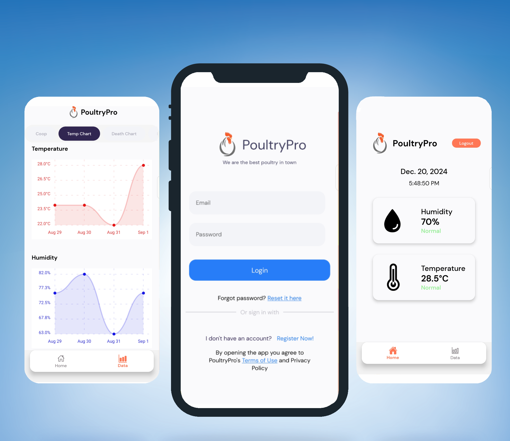

# PoultryPro - Chicken Monitoring System

**PoultryPro** is a **Chicken Monitoring System** developed using **React Native**, **Expo**, **Firebase**, **ESP8266**, and **DHT11** sensors. This system tracks and records various parameters related to the chickens' environment and health, including **mortality**, **temperature**, **humidity**, **cycle batch**, and real-time data monitoring. It also automatically adjusts the **heater** and **exhaust fan** based on real-time temperature and humidity readings to ensure optimal conditions for the chickens.

## Features

- **45-Day Monitoring**: Tracks chicken-related data for a full 45-day cycle.
- **Data Recording**: Records and stores mortality rates, temperature, humidity, and cycle batch for each day.
- **Real-Time Monitoring**: Displays live temperature and humidity readings from the cage in real time.
- **Automatic Equipment Control**: Automatically adjusts the heater and exhaust fan based on real-time environmental conditions.
- **ESP8266 Integration**: Uses the **ESP8266** Wi-Fi module to collect data from the **DHT11** sensor and send it to the Firebase database.
- **Firebase Integration**: Uses Firebase for real-time data storage, authentication, and updates.
- **User-Friendly Interface**: Simple and intuitive UI for users to monitor and manage the chickens' environment and health.

## Installation

### Prerequisites

Make sure the following tools are installed:

- **Node.js** (latest version)
- **Expo CLI**
- **React Native**
- **Firebase Account** (for real-time data storage and authentication)
- **ESP8266** (for Wi-Fi connectivity)
- **DHT11 Sensor** (for temperature and humidity sensing)
- **Arduino IDE** (for programming the ESP8266)

### Steps

1. Clone the repository:

    ```bash
    git clone https://github.com/DevMike13/PoultryPro.git
    cd PoultryPro
    ```

2. Install dependencies:

    ```bash
    npm install
    ```

3. Install Expo CLI (if not already installed):

    ```bash
    npm install -g expo-cli
    ```

4. Set up Firebase:
   - Create a Firebase project and configure it in your app.
   - Get the Firebase config and add it to the `firebaseConfig.js` file in your project.

5. Program the **ESP8266**:
   - Use the **Arduino IDE** to program the **ESP8266** to read data from the **DHT11** sensor and send it to Firebase.
   - Install necessary libraries such as `ESP8266WiFi`, `FirebaseESP8266`, and `DHT` for communication with Firebase and reading from the DHT11 sensor.
   - After programming, upload the code to your ESP8266 to establish communication between the sensor and Firebase.

6. Run the application:

    ```bash
    npx expo start
    ```

7. Open the app in the **Expo Go** app on your phone, or use an **Android/iOS** emulator to run the app.

## Usage

1. **Add New Batch**: Enter the batch details such as batch number, start date, and other relevant data.
2. **Record Mortality**: Track the daily mortality rate of the chickens for the 45-day period.
3. **Monitor Temperature & Humidity**: View real-time temperature and humidity readings for the chicken cage.
4. **Automatic Control**: The system will automatically adjust the heater and exhaust fan based on preset thresholds for temperature and humidity.
5. **Review Cycle Data**: View the complete history of each cycle batch, including temperature, humidity, and mortality data.

## Firebase Integration

The app uses Firebase for:

- **Authentication**: Secure user login and access.
- **Real-Time Database**: Storing and retrieving real-time data like temperature, humidity, and chicken health records.
- **Cloud Functions**: Triggering automatic control over the heater and exhaust fan based on real-time environmental data.

## Real-Time Data

The app allows for real-time monitoring of the following:

- **Temperature**: Displays the current temperature inside the chicken cage.
- **Humidity**: Displays the current humidity level in the cage.
- **Heater & Exhaust Fan Control**: Automatically adjusts based on the readings to maintain optimal conditions.

## Technologies Used

- **React Native**: For building the cross-platform mobile app.
- **Expo**: For rapid development and testing.
- **Firebase**: For real-time database, authentication, and cloud functions.
- **ESP8266**: For Wi-Fi communication between the app and the sensor.
- **DHT11**: For sensing temperature and humidity.
- **Automatic Equipment Control**: Firebase Cloud Functions to control external devices like heaters and fans.

## Screenshots

Here’s how the **PoultryPro** app looks on mobile devices:

